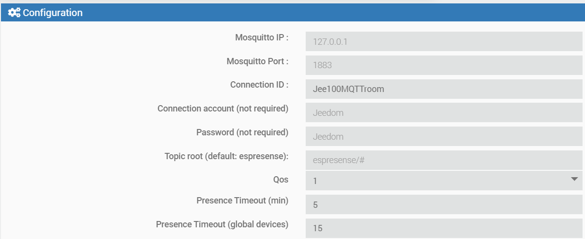

# MQTTroom

MQTT room, detecting room presence using BLE on devices and ESP32 with [espresense](https://espresense.com) or [ESP32 mqtt room](https://jptrsn.github.io/ESP32-mqtt-room) firmware. Usable devices are smart phones, activity bands, BLE tags and others.

##Installation & Configuration

Flash and configure the ESP32 with either ESP32-MQTT-room or espresense. If you use espresense, I recommend setting the following preferences:


Once you have all room presence detection (ESP32), installed in the corresponding rooms, download and install MQTTroom in Jeedom
-	Install dependences if needed. If you have already installed Mosquitto or MQTT plugin, dependencies will appear as OK
- Set configuration parameters as needed



  - Mosquitto IP is the IP address or URL of Mosquitto broker
  - Mosquitto port: Port de connection to Mosquitto (usually 1883)
  - Connection ID: Id of connection between MQTTroom and the mosquito browser, it must be different for each MQTT client connected to the broker
  - Account and password: User and password of the connection to the MQTT broker
  - Topic root: base MQTT topic for the MQTTroom environment. For espresense leave as default
  - Presence timeout: Time (in minutes) of undetected device(s) to mark a room or a device as no presence

Once started the daemon, MQTTroom will detect the existing ESP32 room presence detectors and add automatically to the “Rooms” section of the plugin


To better discover the detectors, put an BLE device (phone, tablet, activity band, …) near each of the detectors
- Add a new device, using the “+” button
- Define all device parameters: name, parent object, …. Set is as enabled
- Using mosquito-client, display the log of MQTT room detected devices
    mosquitto_sub -v -h <IP address> -t espresense/rooms/#
- Find the devices id in the log, i.e.:
```markdown
    espresense/rooms/despacho {"id":"iBeacon:2f234757-cf6d-4a0f-adf2-f4911ba9ffa6-1-0","rssi@1m":-75,"rssi":-96,"mac":"4412ce91ba08","raw":3.98,"distance":2.61,"speed":0.1}
```

  - In the above listed entry, copy the highlighted id, and set as “Name of Device”

  
  
- Save the device configuration
- Once the device will be detected by any of the presence detectors (ESP32), the plugin will automatically add 3 commands:
  - Presence (Boolean)
  - Room name. Room when the device has been detected
  - Distance (numeric)
